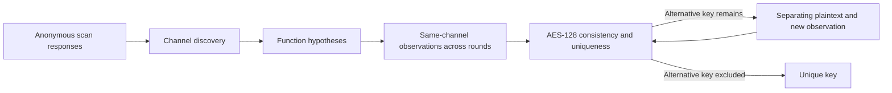

# ASAL
### Adaptive Scan-Based Key Recovery from Sparse AES Subround Leakage

**Can one scan-visible bit reveal an AES-128 key when its logical identity is unknown?** ASAL studies how following the same sparse channel across AES rounds can make the key identifiable, even when a single observation leaves many candidates.

The target is an implementation-created post-MixColumns register. ASAL first finds a channel in anonymous scan responses, retains compatible AES-function hypotheses, and combines observations across rounds. Recovery requires excluding alternative master keys—not merely finding a candidate that fits. If ambiguity remains, an adaptively chosen plaintext supplies another observation.

This repository contains software models, campaign runners, recorded experiment data, and implementation-level fixtures for exploring that process.

## How it works



A numerical scan index need not stay fixed if the same logical channel can be reacquired. The tracking experiment assumes a stable ordering during each probe window.

See [Method](docs/METHOD.md) for the observation model and acceptance criterion.

## The central idea

A single observed bit can be weak evidence at one instant but a much stronger constraint when the same logical channel is observed in successive rounds. AES diffusion and the key schedule tie those observations to one master key. ASAL therefore combines temporal constraints instead of assuming that recovery requires a wide snapshot of the cipher state.

Unknown channel identity is part of the inference problem: discovery narrows the candidates, and each surviving function hypothesis must explain the complete transcript. When two explanations remain, an adaptive query seeks a plaintext on which they disagree and obtains another oracle observation. The stopping criterion is exclusion of alternative master keys, not simply a plausible first candidate. The experiment families separate these ingredients so readers can inspect discovery, uniqueness, adaptive progress and physical feasibility independently.

## Quick start

Requirements: Python 3.10+, Make, and the packages in `requirements.txt`. The software checks do not require commercial EDA tools.

```sh
git clone https://github.com/wlscjf728-jpg/ASAL.git
cd ASAL
python3 -m venv .venv
. .venv/bin/activate
python -m pip install -r requirements.txt
make test
make smoke
make evidence-verify
```

Use `make check` for the extended software/record suite, dry-runs and bounded worker startup. Optional checks for undistributed physical-run bundles are reported as skips; they are not verified results.

If you already have the repository, start from its root. `make smoke` creates an ignored deterministic evaluator-key fixture when needed; it does not require a private device key.

## Choose an experiment

| Command | What it does |
|---|---|
| `make smoke` | Runs setup checks and software unit tests |
| `make discovery-smoke` | Generates and analyzes a small anonymous-channel campaign |
| `make tracking` | Runs behavioral channel reacquisition scenarios |
| `make one-bit-384-dry-run` | Validates both stage configurations and task inputs; no solving |
| `make one-bit-startup` | Executes one fixed and one adaptive worker with bounded solver calls |
| `make one-bit-384` | Runs the complete fixed-to-adaptive reference sweep |
| `make evidence-verify` | Checks bundled hashes and recorded-result consistency |
| `make gate-smoke` | Checks gate-campaign Python infrastructure; does not run VCS |

**Record verification and fresh experiment execution are separate.** The bundled records can be inspected quickly; reproducing full key-uniqueness proofs can require substantial computation.

The full reference sweep defaults to four workers and supports 1–64 via `ASAL_WORKERS`. Solver calls in the full campaign have no timeout. Start with the bounded startup check, and use a scheduler for larger runs.

## Experiments and data

The bundled one-bit manifest contains 128 semantic reference positions—64 MC and 64 ARK—each with three seeds. Its 384 records contain 249 fixed-budget unique outcomes and 135 adaptive recoveries. These describe this manifest; they do not imply that arbitrary physical bits provide equivalent observations.

Separate experiments cover anonymous discovery, key diversity, scan-order tracking, eight gate-level targets, and partial-scan testability. [Experiments](docs/EXPERIMENTS.md) explains commands and scope; [Evidence](docs/EVIDENCE.md) explains the captured data.

## Layout

| Path | Contents |
|---|---|
| `scripts/`, `Makefile` | Stable public entry points |
| `configs/` | Campaign metadata and reference settings |
| `experiments/` | Source families and small fixtures |
| `evidence/` | Frozen source records and integrity manifest |
| `tests/` | Repository-level regression checks |
| `docs/` | Method, execution guide and data navigation |

See the [source-family index](experiments/README.md) for the implementation map. Generated runs belong in ignored output directories.

## Scope and research

The attack assumes authorized test-interface access, chosen plaintexts under a fixed protected key, selectable captures, and repeatable observations. It is not a generic bypass of scan protections. Software semantic sweeps, anonymous discovery, and physical capture experiments are distinct evaluation layers.

**ASAL: Adaptive Scan-Based Key Recovery from Sparse AES Subround Leakage**

Jincheol Jeong, Dongseop Jeong, Sungyoul Seo, and Hayoung Lee.

A distribution license has not yet been assigned. Use the artifact for controlled research on designs you are authorized to evaluate.
